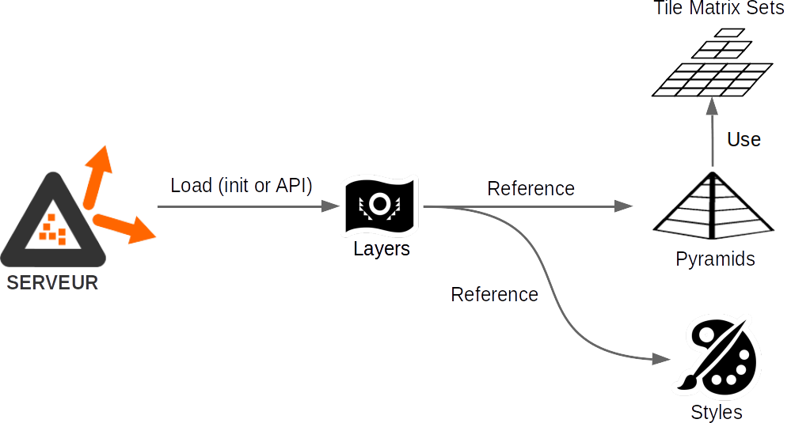

# Serveur de diffusion WMS, WMTS et TMS


Le serveur implémente les standards ouverts de l’Open Geospatial Consortium (OGC) WMS 1.3.0, WMTS 1.0.0 et OGC API Tiles 1.0.0, ainsi que le TMS (Tile Map Service). Il vise deux objectifs principaux :

* L’utilisation d’un cache de données raster unique permettant de servir indifféremment des flux WMS, WMTS, API Tiles et TMS
* Des performances de traitement d’image et de diffusion accrues
* La diffusion de tuiles vecteur telles qu'elles sont stockées, sans transformation (TMS uniquement)
* La diffusion en WMTS selon des Tile Matrix Sets différents de celui de la pyramide utilisée.

Les pyramides de données utilisées sont produites via les outils de [prégénération](https://github.com/rok4/pregeneration) et de [génération](https://github.com/rok4/generation).

L'implémentation s'appuie essentiellement sur la [librairie C++ du projet](https://github.com/rok4/core-cpp).

## Installer le serveur outils (Debian)

Installations système requises (listées dans le paquet debian, installées avec l'applicatif lors du `apt install`) :

* `librok4-dev` (disponible sur [GitHub](https://github.com/rok4/core-cpp/releases/))
* `libcurl4-openssl-dev`
* `libssl-dev`
* `libfcgi-dev`
* `libproj-dev`
* `libboost-log-dev`
* `libboost-filesystem-dev`
* `libboost-system-dev`


```bash
### librok4-dev
curl -o librok4-dev.deb https://github.com/rok4/core-cpp/releases/download/x.y.z/librok4-base-x.y.z-ubuntu-20.04-amd64.deb
# or, with ceph driver
curl -o librok4-dev.deb https://github.com/rok4/core-cpp/releases/download/x.y.z/librok4-ceph-x.y.z-ubuntu-20.04-amd64.deb

apt install ./librok4-dev.deb

### rok4-server
curl -o rok4-server.deb https://github.com/rok4/server/releases/download/x.y.z/rok4-server-x.y.z-ubuntu-20.04-amd64.deb

apt install ./rok4-server.deb

### installation des styles et des tile matrix sets 
curl -o tilematrixsets.deb https://github.com/rok4/tilematrixsets/releases/download/4.1/rok4-tilematrixsets-4.1-linux-all.deb
apt install ./tilematrixsets.deb

curl -o styles.deb https://github.com/rok4/styles/releases/download/4.1/rok4-styles-4.1-linux-all.deb
apt install ./rok4-styles.deb
```

## Utiliser le serveur

Le serveur ROK4 est lancé en mode stand alone. Nous utiliserons ici Nginx comme serveur front pour "traduire" les requêtes HTTP en FCGI et les rediriger vers le serveur ROK4.

### Variables d'environnement utilisées

Leur définition est contrôlée à l'usage.

* Pour le stockage objet
    - `ROK4_OBJECT_READ_ATTEMPTS` : nombre de tentatives pour les lectures
    - `ROK4_OBJECT_WRITE_ATTEMPTS` : nombre de tentatives pour les écritures
    - `ROK4_OBJECT_ATTEMPTS_WAIT` : temps d'attente en secondes entre les tentatives
* Pour le stockage CEPH
    - `ROK4_CEPH_CONFFILE`
    - `ROK4_CEPH_USERNAME`
    - `ROK4_CEPH_CLUSTERNAME`
* Pour le stockage S3
    - `ROK4_S3_URL`
    - `ROK4_S3_KEY`
    - `ROK4_S3_SECRETKEY`
* Pour le stockage SWIFT
    - `ROK4_SWIFT_AUTHURL`
    - `ROK4_SWIFT_USER`
    - `ROK4_SWIFT_PASSWD`
    - `ROK4_SWIFT_PUBLICURL`
    - Si authentification via Swift
        - `ROK4_SWIFT_ACCOUNT`
    - Si connection via keystone (présence de `ROK4_KEYSTONE_DOMAINID`)
        - `ROK4_KEYSTONE_DOMAINID`
        - `ROK4_KEYSTONE_PROJECTID`
    - `ROK4_SWIFT_TOKEN_FILE` afin de sauvegarder le token d'accès, et ne pas le demander si ce fichier en contient un
* Pour configurer l'usage de libcurl (intéraction SWIFT et S3)
    - `ROK4_SSL_NO_VERIFY`
    - `HTTP_PROXY`
    - `HTTPS_PROXY`
    - `NO_PROXY`

### Configurer le serveur

Dans le fichier `server.json`, on précise le port d'écoute :

```json
    "port": ":9000"
```

On configure les logs de manière à les retrouver dans un fichier par jour :

```json
"logger": {
    "output": "rolling_file",
    "level": "info",
    "file_prefix": "/var/log/rok4",
    "file_period": 86400
}
```

Les répertoires dans lesquels sont les tile matrix sets et les styles peuvent être des dossiers (comme `file:///usr/share/rok4/tilematrixsets`) ou des préfixes objets  (comme `s3://tilematrixsets`). Sans préfixe précisant le type de stockage, le chemin est interprété en mode fichier.

* Les paramètres possibles du fichier de configuration `server.json` sont décrits [ici](./config/server.schema.json)
* Les paramètres possibles du fichier de configuration `services.json` sont décrits [ici](./config/services.schema.json)

Vous pouvez valider votre fichier avec l'outil [check-jsonschema](https://pypi.org/project/check-jsonschema/) :

```bash
check-jsonschema /path/to/your/server.json --schemafile ./config/server.schema.json
check-jsonschema /path/to/your/services.json --schemafile ./config/services.schema.json
```

### Lancer le serveur

#### En ligne de commande

La ligne de commande permettant de lancer ROK4 comme instance autonome est la suivante :
```bash
rok4 -f /chemin/vers/fichier/server.json &
```

#### En tant que service systemctl

Selon l'emplacement d'installation, le fichier dans `service/rok4.service` peut déjà être à un endroit pris en compte par systemctl (comme `/usr/lib/systemd/system`). Celui ci est écrit pour un déploiement à la racine, modifiez les chemins pour qu'il soit adapté à votre déploiement. Si l'installation a été faite via le paquet debian, le service est déjà correctement installé, et les configurations sont dans `/etc/rok4`.

```
EnvironmentFile=/etc/rok4/env
WorkingDirectory=/etc/rok4/
```

Le fichier `/etc/rok4/env` permet de définir les variables d'environnement propres au serveur pour configurer l'utilisation de stockages objets (voir [ici](#variables-denvironnement-utilisées)).

Le serveur est lancé en tant que user (et group) `rok4`. Il convient donc de le créer : `useradd rok4`.

Il suffit alors de recharger le démon systemctl avec la commande `systemctl daemon-reload`. Vous pouvez maintenant piloter le serveur ROK4 via ce système, comme le démarrer avec `systemctl start rok4`.

### Installer et configurer NGINX

* Sous Debian : `apt install nginx`
* Sous Centos : `yum install nginx`

Remplacer le fichier `default` présent dans le répertoire `/etc/nginx/sites-enabled` par le contenu suivant :

```
upstream rok4 { server localhost:9000; }

server {
    listen 80;
    root /var/www;
    server_name localhost;

    access_log /var/log/rok4_access.log;
    error_log /var/log/rok4_error.log;

    location /rok4 {
        rewrite /rok4/?(.*) /$1 break;
        fastcgi_pass rok4;
        include fastcgi_params;
    }
}
```

On redémarre nginx : `systemctl restart nginx`

### Accès aux capacités du serveur

* Liste des services de diffusion : http://localhost/rok4/
* GetCapabilities des services de diffusion
    - WMS : http://localhost/rok4/wms?request=GetCapabilities&service=WMS
    - WMTS : http://localhost/rok4/wmts?request=GetCapabilities&service=WMTS
    - TMS : http://localhost/rok4/tms/1.0.0
    - OGC API Tiles : http://localhost/rok4/tiles/collections
* Racine de l'API d'administration : http://localhost/rok4/admin/
* État de santé du serveur : http://localhost/rok4/healthcheck

## Fonctionnement général du serveur

### Identification du service et du type de requête

Lorsque le serveur reçoit une requête, c'est le premier élément du chemin qui détermine le service :

* `/` -> requête globale
* `/healthcheck` -> requête d'état de santé ou statut du serveur
* `/wmts` -> requête WMTS
* `/wms` -> requête WMS
* `/tiles` -> requête API Tiles
* `/tms` -> requête TMS
* `/admin` -> requête d'administration

En WMS et WMTS, si c'est une requête POST, le corps est interprété pour extraire les informations. Seuls le getCapabilities, le getMap et le getTile sont disponibles en POST. Le paramètre de requête ou le corps doit confirmer le service pour que la requête soit valide.

Les requêtes gérées par le serveur sont décrites dans des spécifications au format [Open API](openapi.yaml).

### Accès aux données

L'accès aux données stockées dans les pyramides se fait toujours par tuile. Dans le cas du TMS et WMTS, la requête doit contenir les indices (colonne et ligne) de la tuile voulue. La tuile est ensuite renvoyée sans traitement, ou avec simple ajout/modification de l'en-tête (en TIFF et en PNG). Dans le cas d'un GetMap en WMS, l'emprise demandée est convertie dans le système de coordonnées de la pyramide, et on identifie ainsi la liste des indices des tuiles requises pour calculée l'image voulue. De la même manière qu'en WMTS et TMS, le serveur sait à partir des indices où récupérer la donnée dans l'espace de stockage des pyramides.

Avec les indices de la tuile à lire, le serveur calcule le nom de la dalle qui la contient et le numéro de la tuile dans cette dalle. Le serveur commence par récupérer le header et l'index de la dalle, contenant les offsets et les tailles de toutes les tuiles de la dalle. Le header fait toujours 2048 octets et l'index a une taille connue par le serveur.

Dans le cas du stockage objet (CEPH, S3, SWIFT), les objets symboliques ne font jamais plus de 2047 octets. Cette première lecture permet donc de les identifier (on lit moins que voulu). Dans ce cas, ce qu'on a lu contient le nom de l'objet contenant réellement la donnée (précédé de la signature `SYMLINK#`). On va donc reproduire l'opération sur ce nouvel objet, qui lui ne doit pas être un objet symbolique (pas de lien en cascade). En mode fichier, ce mécanisme est transparent pour le serveur car géré par le système de fichiers.

Une fois que l'on a récupéré l'index, et grâce au numéro de la tuile dans la dalle, on va pouvoir connaître l'offset et la taille. On va donc faire une deuxième lecture de la dalle pour récupérer la donnée de la tuile.

### Gestion des configurations

Au démarrage du serveur, le fichier de configuration globale du serveur est chargé, puis celui des services. Si un fichier / objet est précisé pour les couches, il est lu. C'est interprété comme la liste des chemins vers les descripteurs des couches à charger à l'initialisation. Sinon, le serveur ne contient aucune couche.

Lorsqu'une couche est chargée, les descripteurs de pyramide, de TMS et de styles nécessaire sont chargés à la volée. 

```json
    "configurations": {
        "services": "/etc/rok4/services.json",
        "layers": "s3://layers/list.txt",
        "styles": "file:///usr/share/rok4/styles",
        "tile_matrix_sets": "file:///usr/share/rok4/tilematrixsets"
    }
```

Pour les TMS et les styles, ils sont cherchés dans les répertoires (fichier ou objet) renseignés dans le `server.json`, avec comme nom de fichier objet `<ID du style>.json`. Un annuaire est tenu à jour pour ne charger qu'une seule fois le style ou le TMS.



### Personnalisation des points d'accès aux services

Pour que les URLs présentes dans les réponses des services soient correctes malgré des réecritures, il est important de bien renseigner les champs suivant dans le fichier `services.json`:

```json
    "wms": {
        "endpoint_uri": "http://localhost/rok4/wms",
    },
    "wmts": {
	    "endpoint_uri": "http://localhost/rok4/wmts"
    },
    "tms": {
        "endpoint_uri": "http://localhost/rok4/tms"
    },
    "tiles": {
        "endpoint_uri": "http://localhost/rok4/tiles"
    }
```

## Compiler le serveur (Debian)

### Dépendances supplémentaires

* `build-essential`
* `cmake`
* Pour les tests unitaires
    * `libcppunit-dev`
* Pour la documentation
    * `doxygen`
    * `graphviz`

`apt install build-essential cmake libcppunit-dev doxygen graphviz` 

### Variables CMake

* `UNITTEST_ENABLED` : active la compilation des tests unitaires. Valeur par défaut : `1`, `0` pour désactiver.
* `DOC_ENABLED` : active la compilation de la documentation. Valeur par défaut : `1`, `0` pour désactiver.
* `BUILD_VERSION` : version de la librairie compilée. Valeur par défaut : `0.0.0`. Utile pour la compilation de la documentation.
* `DEBUG_BUILD` : active la compilation en mode debug. Valeur par défaut : `0`, `1` pour activer.

### Compilation, tests unitaires et documentation et installation

```bash
mkdir build && cd build
cmake -DBUILD_VERSION=0.0.0 -DCMAKE_INSTALL_PREFIX=/opt/rok4 ..
make
make test
make doc
make install
```

## Contribuer

Consulter les [directives de contribution](./CONTRIBUTING.md)